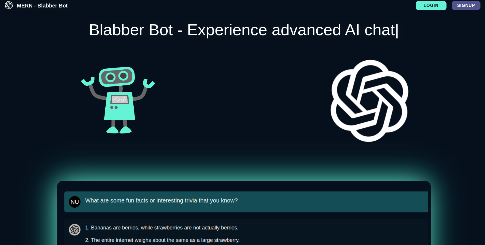

# advancedJS_mern_Blabber Bot: [LIVE DEMO](https://github.com/Shcoobz/mern_blabber-bot)



## Summary

Blabber Bot is an interactive chatbot developed using the MERN stack (MongoDB, Express.js, React, Node.js) and ChatGPT 3.5. It provides a responsive and engaging user experience, leveraging modern web technologies and APIs to facilitate dynamic interactions with users.

The application consists of two main parts:

- **Frontend**: Built with React, offering a dynamic and responsive user interface.
- **Backend**: Node.js and Express.js server, handling API requests, authentication, and data management with MongoDB.

<br>

## Features

### User Authentication

- Secure user authentication including registration and login functionalities.
- User sessions are managed with JWT for security and efficiency.

### Dynamic Chat Interface

- Real-time interaction with the chatbot through a clean and intuitive interface.
- Adaptive responses based on user inputs and questions.

### Conversation Persistence

- Conversations are stored in MongoDB, allowing users to access their history and continue interactions across sessions.

### Technologies

- **MongoDB**: NoSQL database for storing user data and chat logs.
- **Express.js**: Backend framework for managing routes and requests.
- **React**: Frontend library for building the user interface.
- **Node.js**: Runtime environment for the backend server.
- **JWT**: Used for authentication tokens.
- **Bcrypt**: For hashing and securing user passwords.

<br>

## Getting Started

Follow these instructions to set up the project locally.

### Prerequisites

- Node.js (v14 or higher)
- npm (v6 or higher)
- MongoDB (local or cloud instance)

### Installation

1. Clone the repository:

   ```bash
   git clone https://github.com/Shcoobz/advancedJS_mern_blabber-bot.git
   cd advancedJS_mern_blabber-bot
   ```

2. Install backend dependencies:
   ```bash
   cd backend
   npm install
   ```
3. Install frontend dependencies:
   ```bash
   cd ../frontend
   npm install
   ```

### Configuration

1. Create a .env file in the backend directory with the following environment variables:

   ```bash
   PORT=PORT
   MONGODB_URL=your_mongodb_connection_string
   JWT_PRIVATE_KEY=your_jwt_private_key
   COOKIE_PRIVATE_KEY=your_cookie_private_key
   CORS_ORIGIN=http://localhost:PORT
   OPEN_AI_API_KEY=your_openai_api_key
   OPEN_AI_ORGANIZATION_ID=your_openai_organization_id
   ```

### Building and Running

1. Build the backend:

   ```bash
   cd backend
   npm run build
   ```

2. Build the frontend:

   ```bash
   cd ../frontend
   npm run build
   ```

3. Start the backend server:
   ```bash
   cd ../backend
   npm start
   ```

---

_Note: This document provides an overview of Blabber Bot. For detailed instructions and more information, please refer to the source code documentation and the GitHub repository._
